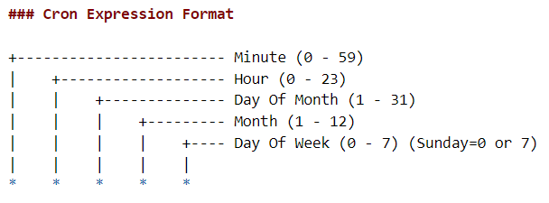

## AWS S3 File Monitoring Service. Welcome...!!!

### Features 
- Jobs Configuration
- AWS Secreat Manager
- AWS S3 File Scan
- Snowflake Table Log
- JIRA Integration 
- Prefect Deployement

### Installation / Getting Started
```
git clone https://github.com/NJOYInc/njoy-file-monitor.git
cd njoy-file-monitor
pip install -r requirements.txt
```


### Flow deployement on Prefect Server 2.0
```
prefect version
```

```
prefect server start
```

```
prefect deployment ls
```

```
prefect deployment build ./file_monitoring_service_flow.py:start_file_monitoring_service -n file-monitoring-svc -q FMS-Test -a
```

```
prefect deployment apply file_monitoring_service-deployment.yaml
```

```
prefect deployment run file-monitoring-service/file-monitoring-svc
```

```
prefect agent start --pool default-agent-pool --work-queue FMS-Test

-n file-monitoring-svc specifies a name for the deployment.
-q FMS-Test specifies a work pool for the deployment. work pools direct scheduled runs to agents.
```

### Documentation For jobs.json
jobs.json is a file which has all the information required to have a job.


```
id                         (Integer) : Unique Id                
job_name                   (String)  : Job Name
description                (String)  : Job Description.
workflow_to_invoke         (String)  : AWS_S3_FILE_CHECK as Default. This parameter is for future script extensions.
bucket_location            (String)  : AWS S3 Bucket Name.
folder_location            (String)  : Folder Location to scan for new file arrival. 
file_prefix                (String)  : Pattern for the expected file to arrive in the bucket location.
additional_filter_required (Boolean) : The folder where the file arrives must ideally have no nested\sub-folders. However, in case of a nested\sub-folder structure, 
                                       set the value to 1 else 0. 
additional_filter_value    (String)  : Specify the Nested\sub-folder folder name to skip if the value in the above parameter                                   "additional_filter_required" is set to 1. Else "".
expected_new_file_count    (Integer) : Expected number of distinct files to arrive in the designated bucket.
scan_type_category         (Integer) : Job Schedule Category. Possible Values are HOURLY/DAILY/WEEKLY/MONTHLY
cron_expression            (String)  : Cron Expression For Scheduling. "minute	hour	day_of_month	month	day_of_week"
```

```
Note: Path = bucket_location + folder_location
```

```
Example:
{
    "id": 1,
    "job_name": "FILE_SCAN_NIELSEN",
    "description": "Run Every Monday at 4:00 AM",
    "workflow_to_invoke": "AWS_S3_FILE_CHECK",
    "bucket_location": "com-njoy-data-transfers",
    "folder_location": "transfers/nielsen/",
    "file_prefix": "Njoy_Weekly_fct_",
    "additional_filter_required": 1,
    "additional_filter_value": "raw",
    "expeceted_new_file_count" : 1,
    "scan_type_category": "DAILY",
    "cron_expression": "0  4  *  *  1"
}
```


